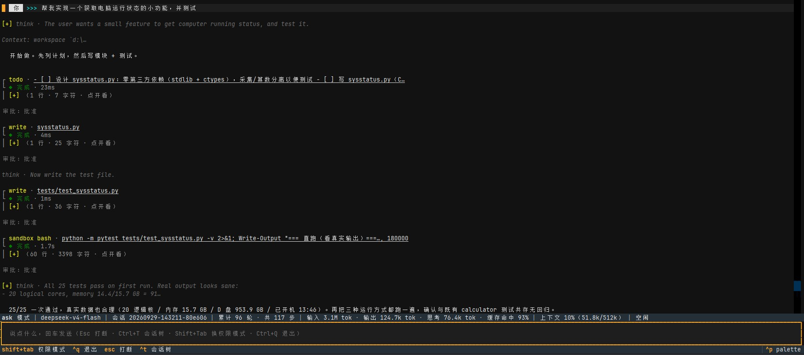
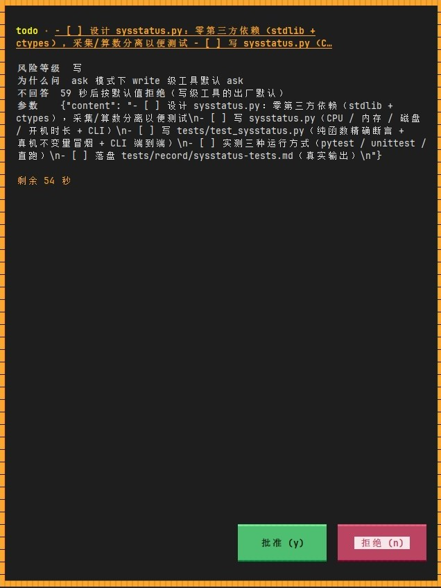
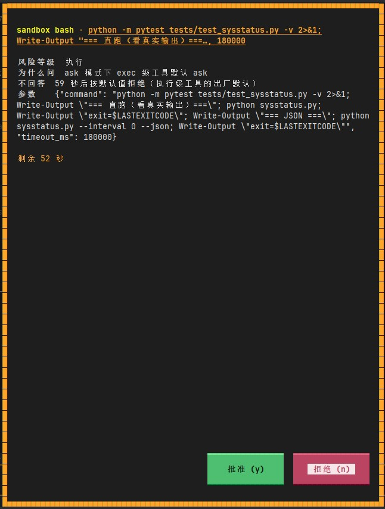

# LiteAgentHarness

## 架构

分两层，依赖只有一个方向：外围 import 内核，内核一次都不 import 外围
（`src/core/` 里 0 处 import `src/harness/`；`src/harness/` 里 28 处 import `src/core/`）。

```
  src/core/  ──yield Event──▶  src/harness/  ──yield Event──▶  caller
   内核                          外围                           (CLI / TUI / eval)
                                      │
                                      └─ write_event() → 会话 .jsonl

  caller  ──gen.send(decision)──▶  harness  ──send──▶  内核      （审批通路）
```

`Harness.run_stream()` 是唯一的执行入口。它逐条转发内核产出的事件，在交给调用方
**之前**先写进会话文件，并把调用方 `send()` 回来的值原样传回内核。审批就是靠这条路直达循环里的
挂起点 —— 不需要线程，也不需要信箱。

---

## `src/core/` —— 内核

把一次用户请求跑完：组装上下文 → 调模型 → 执行工具 → 决定何时停。产出事件，除此之外没有副作用。

| 模块 | 职责 |
|---|---|
| `events.py` (331) | `Event` ＋ 15 种 `EventType`、`DataKey`、`MetaKey`、`Outcome`、`StopReason`、`ApprovalRequest` —— 事件与元信息的数据契约（层间唯一协议） |
| `message.py` (159) | `BaseMessage` 家族、`ToolCall`、`Usage`、无损的 `to_jsonable` / `from_jsonable` —— 消息模型与无损编解码 |
| `models.py` (279) | `BaseChatModel`、`OpenAIChatModel`、`FakeModel`；流式累积（工具调用参数是分片到达的） |
| `tool.py` (713) | `Tool`、`@tool` 装饰器（签名 → JSON Schema）、`CallVerdict`、`ToolResult`、`execute_tool_call()` |
| `toolkit.py` (156) | `make_coding_tools(root)` —— 宿主侧那 7 个编码工具，路径限制在 `root` 里 |
| `context.py` (368) | 两级 token 估算、`should_compact()`、`compact()`、`_safe_cut()`、项目记忆加载（AGENTS.md / CLAUDE.md，单文件 32 KB、合计 64 KB 上限） |
| `loop.py` (492) | `Agent` —— 主循环写成生成器；无进展检测；步数上限 |
| `runtime.py` (47) | `RunContext` / `CallContext` —— 当前 run 与当前工具调用（上下文变量） |
| `errors.py` (27) | 异常层级；`SandboxUnavailable` 的含义是**命令根本没跑** |

---

## `src/harness/` —— 外围

所有需要和外界打交道的部分：装配、持久化、授权、隔离与扩展点。

| 模块 | 职责 |
|---|---|
| `harness.py` (459) | `HarnessConfig` / `Harness` —— 装配 ＋ `run_stream()` |
| `session.py` (327) | `Session`、`SessionStore`、`write_event()`、`replay()`、`_apply_to_window()` —— 会话落盘与重放 |
| `permissions.py` (155) | `PermissionPolicy` —— 模式 × 风险表、失败安全、`AuditEntry` |
| `hooks.py` (100) | `HookManager` —— 五个时机的钩子，可以拦下或改写一次调用 |
| `skills.py` (98) | `load_skills()`、`make_skill_tool()` —— 两级披露 |
| `subagent.py` (172) | `SubagentDef`、`make_task_tool()` —— 静态深度控制 |
| `mcp.py` (177) | `MCPServerStdio` —— stdio MCP 客户端，工具名 `mcp__<server>__<tool>` |
| `sandbox/bash.py` (322) | `SandboxConfig`、`Sandbox`、`make_sandbox_tool()` —— `sandbox_bash` 这个工具 |
| `sandbox/restricted_token.py` (1161) | 受限令牌 ＋ ACL 授权 ＋ Job Object 进程启动 |

---

## 关键设计

### 事件流

15 种事件类型覆盖一次运行的全部动作：会话与运行的起止、模型调用、工具调用、压缩、审批与错误。
每条事件带 `run_id` / `turn` / `span` 关联标识；`parent_span` 只出现在开 span 的事件上，并由
`Event` 的构造函数校验，所以事后能把一次 run 还原成一棵树。

### 工具契约

一个工具 = 一个普通 Python 函数 ＋ 一个装饰器。装饰器读取函数签名（参数名、类型、默认值、说明）
生成 JSON Schema 与参数校验器：字面量类型转成枚举、嵌套模型内联、
`Annotated[..., Field(description=…)]` 的说明能保住、自引用 `$ref` 设深度上限。MCP 工具、技能与
子代理都按同一份 schema 构造，因此共用同一条校验与执行路径。

### 失败降级

`execute_tool_call()` 从不抛异常：工具内部的任何异常都变成一条带错误标记的 `ToolResult`，
作为工具消息回喂模型，循环因此不会被打断。失败状态区分"失败"与"被策略拒绝"、"被钩子拦截"。
超时按**放弃等待**处理：调用跑在守护线程里，`join(timeout)` 到点返回已产生的结果，并把仍在运行的
线程记下来（`thread_leaked`），而不是假装它被取消了。超长结果的全文写入文件，并在结果里记录
取回位置与原始长度。

### 权限裁决

派发之前，调用要过一条判定链：先钩子，后权限策略。权限是一张二维表 —— 4 种模式
（`readonly` / `ask` / `accept_edits` / `yolo`）× 4 个风险等级（`read` / `write` / `exec` /
`spawn`）—— 交叉给出**允许**、**拒绝**或**询问**。两条失败安全：没有登记风险等级的工具按最高档
处理；工具名不在当前实际提供的工具集里的直接拒绝，且不询问。拒绝会记录来源，所以轨迹里能分清
"工具自己失败了"和"根本不让跑"。钩子可以改写调用参数，此时被授权、被执行的正是**改写后**的那个调用。

### 上下文预算与压缩

token 用量分两级估算：一级是锚点（最近一条带用量记录的模型响应，它的计数里已经包含系统提示与
工具声明），二级对锚点之后的内容按字符数估算。压缩在超过上下文窗口的给定比例时触发，有两种策略
—— 清理旧的工具结果，或对较早的消息生成摘要。切分位置保证保留段**不以工具结果开头**，否则历史里
会出现孤儿工具结果、被 provider 直接拒绝。压缩结果写进事件日志，重放时直接采用记录中的结果，
而不是重新计算。

### 轨迹与重放

一个会话就是一份追加式 JSONL。每条事件在交出去之前已经写入文件，所以调用方中途中断也不会丢尾部
记录。重放读取该文件、重建消息历史，不重新运行、也不调用模型；"这条事件让历史变成什么样"的规则
只有一份实现，运行时与重放共用。崩溃过的会话同样可读：残缺的末行会被跳过，末尾未完成的一轮会被
裁掉，保证恢复点是合法的消息边界。

**子代理派出去的活是另一份文件**（`<会话 id>.sub-N.jsonl`，文件头的 `parent` 指回来；子代理再派
就是 `.sub-1.sub-1`），主文件里只留一对链接事件（`tool_result.child_session` 向下、文件头 `parent`
向上）。所以"那次委派到底做了什么"永远查得到，而且**一次委派的记录不会被后续动作改写** ——
它是一份自足的轨迹，可以单独打开、单独统计（`src/eval` 就是这么按子树汇总用量的）。
界面里的入口是 `Ctrl+T` 打开的会话树，见下面「终端界面（TUI）」。

### 沙箱

命令执行被限制在一张**写受限令牌**里，而不是容器里 —— 这样隔离层不需要更换操作系统
（工作区里是一个 Windows 的 venv，换到 Linux 里不可用）。用 `CreateRestrictedToken` 创建受限
令牌；写权限只通过 `SetNamedSecurityInfoW` 授予两个根：工作区与会话私有临时目录，各挂一条带继承位
的 ACE —— 新建对象靠继承拿到授权，已存在的后代由系统在设置时自动传播，无需遍历目录树。进程用
`CreateProcessAsUserW` 启动并纳入 Job Object，以便超时终止整棵进程树。取舍是刻意的：**只限制写、
不限制读**，这样工作区里的 venv、祖先目录与 `NUL` 设备都无需额外授权。

#### 一个机制边界，不是 bug

沙箱进程里用**非 `0o777` 的 mode** 建出来的目录（实测过 `0o700`，也就是 `tempfile.mkdtemp()` 用的
那个；其他值没逐个验）会得到一个**带"停止继承"标记的显式 DACL**，里面只有 `OWNER RIGHTS` /
`SYSTEM` / `Administrators` 三条 —— **那张工作区卡不在里面**，而"停止继承"意味着它**以后也永远
拿不到**。于是这个目录对**沙箱进程以及任何受限身份**从此不可访问：读、写、删、连读它的权限表都
失败；但对**普通身份**（父进程、你自己的终端）完全正常。授权只有两条路能进新对象 —— 创建时继承、
或不指定 DACL 时走令牌默认 DACL；而"自带一份受保护的 DACL"的创建把两条路都绕过了。Windows
用户态没有"创建时同步改权限"的钩子（那要文件系统过滤驱动），所以这是**这一档隔离强度的边界，
不是实现失误**。

**使用建议** —— 把沙箱进程产生的这类对象**统一收在同一个父目录下**，清理时在**父进程**（普通终端）
里删那个父目录：一条 `Remove-Item -Recurse -Force` 全部带走，而且**不需要提权**（这些对象的属主就是
你）。沙箱已经交给子进程的**会话私有 `TEMP`** 正是这样一个地方，写进去的临时物自然集中，删它就行。
反过来，**别在工作区里到处 `mkdtemp`**：pytest 的缓存插件就是反面教材 —— 它每跑一次就建一个，
所以本仓库直接把它关掉了（`-p no:cacheprovider`，见 `pyproject.toml`）。

### 扩展点

子代理、技能与 MCP 都从工具面进入，所以主循环里没有针对它们的特殊分支。子代理通过 `task` 工具
派发，深度控制是**静态**的：子代理的工具表在构造时就决定要不要给它 `task` 工具，而不是运行时再拦。
技能采用两级披露 —— 系统提示里只放技能清单，正文由模型按需通过 `read_skill` 取回。MCP 是 stdio
客户端，把远端服务声明的工具按 `mcp__<server>__<tool>` 并入本地工具表。

---

## 快速开始

终端界面的配置写在项目本目录的 `config.yml` 里（三层优先级：**命令行 > `config.yml` > 代码里的
默认值**）—— 细节见下面「终端界面（TUI）」：

```powershell
python -m tui D:\work\my-project      # 进入界面；配置在 config.yml 里
python -m tui --show-capabilities     # 只打印能力面（工具／技能／子代理／沙箱／MCP／模型），不进界面
python -m tui --show-tree <会话 id>    # 只打印会话树（子代理的子子孙孙）＋状态，不进界面
```

**用哪个 Python**：上面几条用的是裸 `python`，所以先让当前 shell 指向本项目的环境 —— 在工作区的
shell 里执行（路径写全，**在哪个目录下敲都一样**）：

```powershell
<项目根目录>\.venv\Scripts\Activate.ps1
```

之后就加载了这个项目的虚拟环境：裸 `python` / `pytest` 都指向它，提示符也会变成那个环境的名字。
**前提是那台机器上已经有这个虚拟环境**（没有 `.venv\` 就得先建一个、按「环境要求」装上依赖）；
Windows 上第一次用 `.ps1` 若报执行策略错误，先
`Set-ExecutionPolicy -Scope CurrentUser RemoteSigned`。

不激活也能跑 —— 直接写全路径，效果一样：

```powershell
<项目根目录>\.venv\Scripts\python.exe -m tui D:\work\my-project
```

两条路的效果一样，差别只是**裸 `python` 指向谁**。至于 `import src` / `python -m tui` 能不能跑 ——
那由虚拟环境 `Lib\site-packages` 里那条指向仓库根的 `.pth` 决定，**跟激不激活无关**。

**为什么它能在任何目录下跑：`.pth` 那一行**

本项目没有走 `pip install -e .` 这类"安装"步骤，所以 Python 默认只在**当前目录**和**已装的包**里找
模块 —— 也就是只有站在项目根目录里才 import 得到它自己的代码。让它在任何目录下都成立的，是虚拟
环境里一个很小的文件：

```
<项目根目录>\.venv\Lib\site-packages\<随便起个名字>.pth
```

内容就一行，指向项目根目录：

```
<项目根目录>
```

几条要知道的：

- 路径必须**真实存在**，否则那一行**静默无效**（不报错、不提示）；相对路径按 `site-packages` 解析，
  写绝对路径最省事；一行一个目录（多行 = 挂多个）；
- `#` 开头是注释行，可以拿来写一句"这行是干什么的"；编码用 UTF-8 即可（**带不带 BOM 都可以**）；
- 别把文件设成**隐藏**属性 —— 隐藏的 `.pth` 会被整个跳过；
- 它是**虚拟环境自己的属性**，所以不用激活也在（"激活"和"能不能 import 项目"是两件事）；
- **重建虚拟环境不会把它带回来**，得补一次；想省掉这一步就改用正规安装 `pip install -e .`
  （会自动生成等价的东西，还能跟着目录一起移动）；
- 它对这个环境里的**所有**进程生效：别的项目里若有同名的顶层包（比如都叫 `src`），可能认到这边来。

想确认它生效了没，从**别的目录**跑一行就知道（末尾应当出现项目根目录）：

```powershell
<项目根目录>\.venv\Scripts\python.exe -c "import sys; print(sys.path[-1])"
```

界面里 `Ctrl+T` 打开的就是这棵树：这个会话派出去的子代理（以及它们再派的），每个都带四态状态
（`● 正在进行` / `○ 未收尾` / `◆ 完成` / `▲ 失败`）。点进去看是**只读**的 —— 那条子会话文件是
"那次委派到底做了什么"的记录，看一眼不该改它。

MCP 接在一份**单独的配置文件**里，`config.yml` 只放它的路径（`mcp.config`）：留空就是完全不碰 MCP。
填了就**在启动时整份校验，坏了直接停止启动**（文件不在、没有 `mcpServers`、键名写错、命令不在
`PATH` 上……），而且这一切发生在**碰工作区之前**。写法见下面「MCP：一份配置放路径，另一份放 server」。

当成库来用：

```python
from src.core.models import OpenAIChatModel
from src.harness.harness import Harness, HarnessConfig
from src.harness.sandbox.bash import SandboxConfig

workspace = r"D:\work\my-project"          # 模型能改的唯一目录

harness = Harness(HarnessConfig(
    model=OpenAIChatModel(model="gpt-4o-mini",
                          base_url="https://api.openai.com/v1", api_key="sk-..."),
    workspace=workspace,
    session_root="sessions",               # 会话 JSONL 落在哪
    permission_mode="ask",                 # readonly / ask / accept_edits / yolo
    sandbox=SandboxConfig(workspace=workspace),   # 给了才有 sandbox_bash 这个工具
))

harness.open()                             # 新建会话，或接上这个工作区最近的一条
for event in harness.run_stream("把 a.py 里的导入错误修好"):
    print(event.type, event.data.get("duration_ms"))
harness.close()
```

`OpenAIChatModel` 收 `model` / `base_url` / `api_key`，外加一个**可选**的 `provider` 标注
（默认 `"unknown"`）：它只是个标注，不影响请求怎么发 —— 它写进会话头的元信息，并用于"思考模式
写法"这类判断。

说明：

- 不传 `sandbox=` 时不会暴露 `sandbox_bash`，仓库里也没有宿主侧 shell —— 执行命令这件事干脆不在
  工具面里。
- `run_stream()` 逐条产出事件；审批请求以 `approval_request` 事件出现，用 `gen.send(decision)` 回决定。
- `FakeModel(script=[...])` 可以完全离线跑通整条链路。

---

## 终端界面（TUI）

`Harness` 的消费者：把事件流画成一屏能读的时间线，把人在键盘上做的决定送回内核。
**内核与装配层一行都没为它改**（见下面「依赖方向」）。

（下面几条用的是裸 `python` —— 让它指向本项目的环境见「快速开始」的**用哪个 Python**。）

```powershell
python -m tui                                  # 当前目录当工作区，新建一条会话
python -m tui D:\some\project                  # 指定工作区
python -m tui --list                           # 先看有哪些会话可以接
python -m tui --session 20260928-153012-ab12cd # 接着某条聊（历史会被画回来）
python -m tui --show-capabilities              # 只打印能力面，不进界面
python -m tui --show-tree 20260928-153012-ab12cd           # 只打印会话树（子代理的子子孙孙）
python -m tui --show-sub 20260928-153012-ab12cd.sub-1      # 只打印一条会话的时间线
python -m tui --config D:\my.yml               # 换一份配置文件
```

**长期配置写在 `config.yml` 里**（项目本目录下那份），命令行只用来临时盖一次：

```powershell
python -m tui --mode accept_edits              # 覆盖配置里的权限模式（界面里 Shift+Tab 也能换）
python -m tui --model deepseek-chat            # 覆盖模型名
python -m tui --sandbox                        # 覆盖沙箱开关（--no-sandbox 反过来）
python -m tui --subagent "explorer|探索代码库，只读|你是探索者，只读不写。"
```

### 配置：一份 `config.yml`

三层，谁压谁：**命令行参数 > `config.yml` > 代码里的默认值**。长期的东西写文件，临时改动用命令行
—— 于是"这个 agent 到底配了什么"有一个看得见、留得住的地方。

```yaml
model:
  base_url: https://api.deepseek.com     # 必填
  api_key: sk-...                        # 必填
  name: deepseek-v4-flash                # 模型名
  provider: deepseek                     # 只写进会话元信息，并用于"思考模式写法"这类判断
  kwargs: {}                             # 直通给 OpenAI 客户端的参数（temperature / extra_body）

summarizer:
  name:                                  # 留空 = 与主模型相同（另起一个不绑工具的实例）

harness:
  permission_mode: ask                   # readonly / ask / accept_edits / yolo
  max_turns: 40
  max_context_tokens: 60000

capabilities:
  sandbox: false                         # true = 多一个 sandbox_bash
  skills_dir:                            # 留空 = 看 <工作区>/.harness/skills
  subagents: []                          # 每项：name / description / system_prompt

ui:
  fold_chars: 400                        # 思考块超过这么多字符就折起来

mcp:
  config:                                # MCP server 配置文件的路径；**留空 = 不接 MCP**
```

几条规矩：

- **只有 `model.base_url` 与 `model.api_key` 是必填的**，缺了**当场报错并点名是哪一项** ——
  猜错的后果是"跑完一批数据，事后才发现打到了别处"。其余每一项代码里都有默认值，yml 里没写就用
  默认值。**但配置文件本身必须存在**：不给路径就找项目本目录的 `config.yml`，那个文件也没有就报错
  （不"没配就用一份全默认的配置" —— 那样报错会推迟到第一次模型调用，而且报得很难懂：
  api_key 为空 → 401）。
- **`workspace` 与 `session_root` 刻意不在配置文件里**：前者每次跑都可能不同（命令行第一个位置
  参数，默认当前目录），后者固定是 `<仓库根>/sessions`（要换用 `--session-root`）。放进配置文件
  等于让"这次动哪个项目"变成一次容易忘记改的全局状态。
- **`--list` 不读配置、也不造模型**：它只读会话目录 —— "我上次那条会话叫什么"跟 key 没关系。
- 类型写错（比如 `max_turns: 很多`、`sandbox: "是"`）会在**加载时**报错并说出是哪一项，而不是等到
  用的时候崩在某个深处。注意 `yes` / `no` 是 YAML 的布尔字面量。
- 配置文件里的 **`subagents` 没写 `tools` 时，默认给它父代理那套编码工具** —— 一个工具都没有的
  子代理连文件都读不了（它只能"说话"），那样委派出去没有意义。

### 工作区与会话文件：两个容易混的东西

**第一个位置参数是工作区，不是会话 id。** 两者在命令行上挨得很近，混了却会静默出事：一个不存在的
路径会被当成**新工作区建出来**（工具层要有一个根才能解析文件路径，见 `src/core/toolkit.py` 的
`make_coding_tools` 里那句 `mkdir`），于是工作区里会凭空多出一个空目录。所以参数名长得像会话 id
（`日期-时间-6 位十六进制`）而那个目录又不存在时，程序**直接拒绝**并告诉你怎么接着聊 ——
曾经有人把状态栏上的会话 id 当成工作区传进去，工作区里就此长出一个以会话 id 为名的空文件夹，
事后谁也说不清那是什么。

**会话文件不在工作区里**，在 `<仓库根>/sessions/<会话 id>.jsonl`：`DEFAULT_SESSION_ROOT` 刻意算成
绝对路径，就是为了不让"数据跟着被试对象走"（否则删掉工作区就把轨迹一起删了）。`--session-root`
可以换地方，相对路径按**仓库根**解析。

### 能力面：默认全关，配了才有

`HarnessConfig` 里那几样开关**默认都是关的**，所以"这个 agent 有什么本事"必须显式配：

| 能力 | 怎么开（配置文件里的写法 ／ 命令行覆盖） | 打开后多出什么 |
|---|---|---|
| 编码工具 | 默认就有 | `read_file`、`write_file`、`edit_file`、`list_dir`、`glob_files`、`grep`、`todo_write` |
| 沙箱 | `capabilities.sandbox: true` ／ `--sandbox` | `sandbox_bash`（宿主内写受限令牌，**只挡写、不挡读**）。**不开就一个执行命令的工具都没有** |
| 技能 | `capabilities.skills_dir` ／ `--skills-dir`，或工作区里放 `.harness/skills/<名字>/SKILL.md` | `read_skill`，外加 system prompt 里的技能清单（第一级披露） |
| 子代理 | `capabilities.subagents`（列表）／ `--subagent "名字\|描述\|system prompt"` | `task`。**描述是写给主模型看的** —— 它靠这段话决定什么任务派给谁 |
| 摘要模型 | `summarizer.name`（留空 = 与主模型同款）／ `--summarizer-model`、`--no-summarizer` | 上下文压不动时用 AI 摘要兜底；关了就只剩"清掉旧工具结果"那一档 |
| MCP | `mcp.config: <那份配置文件的路径>`（**留空 = 不接**；没有命令行开关） | 那份文件里每个 server 的工具，名字是 `mcp__<server>__<tool>` |

几条设计取舍：

- **技能目录的默认位置是 `<工作区>/.harness/skills/`**。`.harness/` 是仓库里已有的位置约定
  （工具结果转存就落 `.harness/results/`），技能跟着它走，用户不必记第二套路径；那个目录不存在就当
  没有技能 —— 不硬塞空目录，也不因为"没建技能目录"而报错。
- **`--subagent` 用竖线分段，不用 JSON**：Windows 上 PowerShell 会把原生命令参数里的双引号吃掉，
  这个仓库真踩过（`--mounts '{"json": 1}'` 到程序里成了 `{json: 1}`）。**配置文件里没这个问题**，
  那边直接写 YAML 列表。两条路都**当场拒绝重名** —— `make_task_tool` 按名字建字典，重名是静默覆盖。
- **摘要模型必须是另一个没绑工具的实例**（`ContextManager.summarize` 直接调它，绑了工具就会把整份
  工具清单一起发出去，既贵又跑偏），所以按配置**再造一个**，而不是复用主模型对象。
- **沙箱默认关**：它会往工作区挂真实 ACE、用受限令牌起进程（`src/eval` 那边的默认也是关）。想要
  默认开就改 `config.yml` 里那一行 —— 这是留给你的选择，不是定论。

#### MCP：一份配置放路径，另一份放 server

**分两份文件是有意的**：`config.yml` 里那一项只是**一个路径**（`mcp.config`），server 清单在它指向的
那份文件里。理由是两件事的性质不同 —— 主配置是"这台机器上怎么跑这个 harness"（含 key），MCP 清单是
"接哪些外部工具"，后者会常常换、也常想跟着某个项目走，而且**行业里已经有一份通用写法**
（Claude Desktop 那套 `mcpServers`），照抄它就没必要再发明一套。

那份文件的写法（JSON 或 YAML 都行，JSON 本身就是 YAML 的子集）：

```yaml
mcpServers:
  filesystem:                    # 键 = server 名，会进工具名的中间那一段
    command: npx                 # 要启动的命令：PATH 里的名字，或绝对路径
    args: ["-y", "@modelcontextprotocol/server-filesystem", "D:/work"]
    env:                         # 追加给子进程的环境变量（可选）
      GITHUB_TOKEN: xxx
    timeout_s: 30                # 单次请求超时秒数（可选，默认 30）
```

`command` 也可以写成**整个列表**（`command: [npx, -y, ...]`），那时就**不要再给 `args`** ——
两处都写谁也说不清谁接谁，所以直接报错。同理，**多出来的键一律拒绝**：把 `command` 写成 `cmd` 却被
静默忽略，结果就是"配置看着生效了、其实没生效"，那比报错难查得多。

几条要记住的：

- **启动时整份校验，坏了就停下**。`mcp.config` 一旦指向某个文件，程序在**碰到工作区之前**就把它
  查完：在不在、能不能解析、有没有 `mcpServers`、每项的 `command`/`args`/`env`/`timeout_s` 类型
  对不对、命令在不在 `PATH`（或那个绝对路径存不存在）。任一条不过就**打警告、返回 2、不进界面**。
  这一档**连 `--show-capabilities` 也不放行**（那边只对模型配置宽容）：别的能力坏了是"少一个工具"，
  MCP 坏了是"你以为有一批工具、其实一个都没有"，那要到模型真去调它时才暴露 —— 那时人已经在一个
  残缺的环境里干了一会儿活了。
- **校验 ≠ 连接**。这里**不启动任何 server**：起子进程、握手、问 `tools/list` 是打开会话时的事
  （`Harness._build_agent`）。所以"配置对不对"在毫秒内就知道，"server 能不能跑起来"仍然等到真要用。
  代价是启动时不连，也就**不会**提前发现"命令存在但一跑就崩"。
- **`env` 是合并，不是替换**：server 通常是个解释器或 `npx`，`PATH` 一类必须留着；不写 `env` 就是
  完全继承父进程。
- **工具名会被净化**：`mcp__<server>__<tool>` 里不符合内核命名规则（`^[a-z_][a-z0-9_]*$`）的字符
  一律换成 `_`，大写也降成小写。所以 `fs` 里的 `read-file` 到模型那儿是 `mcp__fs__read_file`，
  界面上念成 `mcp fs read_file · <参数>`（见「工具那一行怎么念」一节）。
- **相对路径按那份 `config.yml` 所在目录解析**，不是按当前工作目录：同一份配置在哪儿跑都该指向
  同一个文件。

**`--show-capabilities` 的由来**：能力面是"配了才有"的，光看界面看不出来装没装上。这个开关
**不打开会话、不进界面**就把工具清单、技能、子代理、沙箱、MCP、摘要模型列一遍 —— 比"跑一遍试试"
省事，也不会在工作区里留下会话文件（工具清单读的是 `policy.known`，就是真正交给模型的那份）。
开屏的第一条提示也写着同样的摘要，所以进了界面也一眼看得见。

**沙箱与 MCP 这两档要单独说明**：它们的工具不在上面那份清单里。沙箱要打开会话才装配（挂 ACE 要
遍历工作区树），MCP 要打开会话才启动（起子进程要握手，真实工具名是问出来的）。所以清单里报的是
**配置里声明了什么**，并单独说一句"它们要打开会话才进来"。

### 键位

| 键 | 作用 |
|---|---|
| `Enter` | 发送；**运行中**则是插话（见下） |
| `Esc` | 打断当前一轮（协作式：内核在下一个消息边界停下） |
| `Shift+Tab` | 轮转权限模式：`ask` → `readonly` → `yolo` → `accept_edits` |
| `Ctrl+Q` / `Ctrl+C` | 退出 |
| 审批弹窗里 `y` / `n` / `Esc` | 批准 / 拒绝 / 拒绝（**关掉一个待批的写操作，默认是不写**） |
| 鼠标点折叠块 / 聚焦后 `Enter` | 展开或收起思考内容、工具结果（见「折叠」一节） |
| `Ctrl+T` | 打开**会话树**：这个会话派出去的子代理（以及它们再派的），都挂在一棵树上 |

### 界面上有什么

时间线上一个块一件事，**一条回答只占一块**（几百条 `text_delta` 是就地续写，不是几百个控件）：

```
你 >>> 帮我把测试跑通                            ← 用户消息：箭头而不是竖线，免得和工具块的 │ 混
think · 先看看仓库里有什么，再去跑测试…          ← 思考增量（压暗＋斜体，前缀只打一次）
┌ read · README.md                            ← 调用的那一刻就出现（不是跑完才补）
└ ◆ 完成 · 12ms
│ [+] （42 行 · 1380 字符 · 点开看）            ← 正文默认整块折着，点一下才展开
┌ sandbox bash · python -m pytest -q, 60000
└ ▲ 失败 · 1.2s
│ [+] （18 行 · 520 字符 · 点开看）
README.md 里说 build 用 `python -m demo` 就够了  ← 助手回答：**按 Markdown 渲染**
· 本轮结束：正常收尾 · 入 12.4k 出 812 缓存 87% · 3.2s · 3 轮
```

真实终端里就是上面这一屏（构成见下面几节）：



**助手回答与工具正文按 Markdown 渲染**（`textual.widgets.Markdown`：标题、列表、表格、代码块、
粗体都认）。流式也是直接更新那个 Markdown 控件 —— 实测 `update()` 约 **0.23ms** 一次，20Hz 的
刷新频率完全吃得下，不必"先纯文本、完成后再转 Markdown"。

两条要注意的：

- 用户消息**不**走 Markdown（保持原样转义）：它多半是随手敲的一句话，而 Markdown 会吃掉里面的
  `*` `#` `[` 这些字符；
- 工具正文**原样交给 Markdown 解析**，所以"本来就带格式的文本"会被重排 —— 比如 `read_file` 那种
  带行号的输出，tab 会被当成表格分列。要退回纯文本的话，改 `ToolBlock.compose` 里那句
  `Markdown(...)` 为 `Static(...)` 即可（一处）。

**思考过程**写成一行 `think · …`。终端里**没有"小一号字体"这回事**（字号由终端与用户设置决定，
程序只能改颜色、粗体、斜体、下划线），所以"更小一号"在这里的等价物是**压暗 ＋ 斜体**：读起来是
背景音，而不是回答。整段只打一次 `think ·` —— 增量是往同一块里续写的，每片都带前缀就会刷出一排
`think · think · think ·`。

**思考过程有两条来源**，所以"重进会话之后思考就没了"这件事不存在：

- **实时**：看的是 `reasoning` 增量事件（它 live-only、**不落盘**）；
- **重进会话**：回放是从助手消息的 `reasoning_content` 画出来的 —— 那段思考在消息里，跟着
  `assistant_message` 一起落盘了。

#### 会话树：子代理派出去的子子孙孙（`Ctrl+T`）

一次委派会**另开一个会话文件**（`<主会话 id>.sub-N.jsonl`，文件头的 `parent` 指回来），子代理再派活
就是 `<主会话 id>.sub-1.sub-1` —— 所以它天然是一棵树（深度到 `max_depth` 为止，眼下是三层）。
`Ctrl+T` 打开的就是它：

```
20260929-143211-80e606 · 主会话 · 15 轮 · 96 步 · 2.5M tok
  ◆ sub-1 · explorer · 完成 · 2 轮 · 7 步 · 4.2k tok · “看看沙箱是怎么实现的”
    ◆ sub-1.sub-1 · reader · 完成 · 1 轮 · 2 步 · 900 tok · “读一下那个文件”
  ○ sub-2 · explorer · 未收尾 · 1 轮 · 3 步 · 1.1k tok · “再看看测试怎么写的”
  ▲ sub-3 · explorer · 失败 · 2 轮 · 5 步 · 3.0k tok · “跑一遍那个脚本”
```

**入口为什么是一个键，而不是"点时间线上那一行 `（子会话 …）`"**：那是"凭线索找" —— 委派一多，
滚回去找那一行很烦。树是**总览**：一眼看得出这个会话派过几个、各自在干嘛，以及**有没有哪次委派
没留下结论**。

| 键 | 干什么 |
|---|---|
| `↑↓` | 走。**移动光标不会打开任何东西**（方向键只发 `NodeHighlighted`） |
| `Space` | 展开/收起这一枝（**逐步展开**：子节点默认是收着的） |
| `Enter` / 点那一行 | 打开选中的会话（**只读**，见下）；在**根**上回车＝回到时间线 |
| `Esc` | 关掉树 |

几条取舍：

- **状态是四态，不是两态**。"文件末尾没有 `session_end`"有**两种完全不同的原因**：那次委派
  **还在跑**（父的这一轮还在飞）→ `● 正在进行`；**没写收尾就没了**（被打断 / 进程没了 / 工具超时）
  → `○ 未收尾`。混成一句"进行中"，会让一次丢了结论的委派**永远看起来在干活** —— 而"哪次委派没留下
  结论"恰恰是这棵树最该一眼看见的东西。另外两态是 `◆ 完成` 与 `▲ 失败`（后者按括号结果的
  `outcome` 判）。
- **根不给状态**：主控会话的 `session_end` 要等退出程序才写，按文件判它会一直显示"未收尾" ——
  你正在里面坐着，那显然不对。它的状态在状态栏上。
- **每行都带账**：`2 轮 · 7 步 · 4.2k tok`。步数**减掉了那个"委派括号"**（子文件里第一对
  `tool_start`/`tool_result` 是**父**的那次调用，不是子代理干的活）；用量取括号结果里那一份，
  它已经是**整棵子树的全量**，所以下级的用量不再加一遍。
- **运行中会自己刷新**（每秒一次，且**只在真有变化时**重建，免得把你展开的状态抖掉）：委派还在跑
  的时候能看着它从"正在进行"变成"已完成"。
- **字形**：树自带的收起标记是 `▶`（U+25B6，**不在 GBK 里**），换成了 `[+]` / `[-]` —— 和时间线上
  折叠块**同一个记号**。引导线那些 `├ └ │ ─` 本来就在 GBK 里。

#### 看子会话是**只读**的

`Enter` 进去看到的是**那条 `.sub-N.jsonl` 的时间线**，和主时间线同一套渲染（工具块、折叠、
Markdown、下划线都一样）。抬头两行写清"它是谁、它怎么了、花了多少"和"派它去干什么"：

```
◆ 20260929-143211-80e606.sub-1 · 完成 · explorer · 2 轮 · 7 步 · 4.2k tok · 118ms
委派内容：“看看沙箱是怎么实现的，只读”
```

**为什么只读、不能接着聊**：

- 子代理内部**不审批**（给它判定链，但不给审批入口），所以"继续"要么跑不动、要么行为和在主会话里
  的预期不一致；
- 更要紧的是**它的文件是证据**。接着聊会往那条委派记录里追加事件，`closed` 也跟着从真变假 ——
  看一眼不该改东西。真要接着做，正确的事是**新派一次**。
- 一路上**不用 `Harness.open(child_id)`**：那会把 `harness._session` 换成子会话，之后 `run_stream`
  就往那条记录里写。这里只走 `SessionStore.events_of()`（纯读）。（顺带一提：
  `python -m tui --session <主会话>.sub-1` 是**能跑通**的 —— 子会话继承了父的 `meta.workspace`，
  工作区校验会过 —— 那正是要避免的用法。）

时间线开头那对"委派括号"被**去掉了**（它是父的那次调用，留着会让人以为"这个子代理又派了一次"），
所以那句 prompt 由抬头第二行补上；子代理**自己**再派出去的 `task` 照常留在时间线上。

一次只看一个：看完 `Esc` 回树、再 `Esc` 回时间线 —— 一层一个 `Esc`，层级不会迷路。

`--show-tree <id>` 与 `--show-sub <id>` 是不进界面的同一份东西（纯文本，见上面用法）：
**树的数据全在文件里**，把出口也做成纯文本，"这棵树对不对"就不必靠盯着屏幕看。

#### 折叠：默认折着，点一下就展开

两类内容都会折，但**规则不同**（它们的"太长"不是一回事）：

| 内容 | 默认 | 折叠态显示什么 | 阈值 |
|---|---|---|---|
| 思考过程 | 超限才折 | 前 N 个字符 ＋ `…` | `config.yml` 的 `ui.fold_chars`（默认 400） |
| 工具结果正文 | **一律折着** | 一行"（N 行 · M 字符 · 点开看）"，**不露内容** | 没有阈值 —— 结果常是几十行文件内容或日志，摊在时间线上会把对话淹掉 |

行首一个记号，点一下就切：

| 记号 | 意思 | 怎么切 |
|---|---|---|
| `[+]` | 折着（默认） | **点这一块的任何位置**，或聚焦之后按 `Enter` / `Space` |
| `[-]` | 展开着 | 同上 |

几条取舍：

- **记号用 ASCII，不用更好看的 `▶` / `▼`**：`▶`（U+25B6）**不在 GBK 里**，而界面字形有一条
  "只用 GBK 里有的"的硬规矩（`•` 那个事故见 `console.py`）。`[+]` / `[-]` 顺带把"这里能点"写在了
  脸上。
- **整块可点，不是只点那个记号**：一个字符宽的目标在终端里很难点中，而这一块本来就只有
  "展开/收起"一个动作 —— 点哪儿都一样。
- **折叠提示里带上尺寸**：只写"点开看"等于让人盲点，`（42 行 · 1380 字符 · 点开看）` 才让人决定
  值不值得点。
- **短思考不折、也不给记号**：给一个点了没反应的记号比不给更糟（`Foldable` 直接忽略点击）。
- **你点过之后就是你说了算**：展开着的时候新内容继续实时续写，不会自动折回去；没点过时，内容一
  超过阈值就自动折起来。
- **回答不折**：它就是要读的那一段。

工具结果这一条尤其值当 —— 以前是条**死路**：只写"省略 42 行"，想看全文得自己去翻会话文件。

**被拒 / 被拦不算失败**：`◆ 完成` / `▲ 失败` / `○ 被权限拒绝` / `○ 被钩子拦下` 是四件事，颜色也
不同 —— "工具没跑"和"跑了但失败"混在一起，事后根本读不出发生了什么。

**用户消息整块提出来**：底色带 ＋ 左侧一条粗竖线 ＋ 上下留白，记号 `你` 反显，写成 `你 >>> 内容`。
理由是时间线上其余内容全是左对齐的日志式排版（`┌ └ │`、`think ·`、压暗的通知），用户自己说的那句
**不靠结构就分不出来**。终端里**没有字号可改**（字体由终端与用户决定），所以能用的杠杆只有
底色／边框／留白／粗细这几样：底色是"区块级"的差别，比换前景色（跟着用户主题走、对比度不可控）和
加粗（很多字体里几乎看不出来）都稳。底色刻意与状态栏那档区分开，否则上下两块会糊成一体。

#### 工具那一行怎么念

工具面里**本地**那些是固定的，所以按名字查表决定"显示哪个参数"，而不是把整个参数 JSON 摊开
（`write_file` 的 `content` 可能有几十 KB，摊开等于把标题行淹掉）：

| 工具 | 显示成 | | 工具 | 显示成 |
|---|---|---|---|---|
| `read_file` | `read · <path>` | | `todo_write` | `todo · <content>` |
| `write_file` | `write · <path>` | | `read_skill` | `read skill · <name>` |
| `edit_file` | `edit · <path>` | | `sandbox_bash` | `sandbox bash · <command>, <timeout_ms>` |
| `list_dir` | `list · <path>` | | `task` | `子代理 task · <agent>` |
| `glob_files` | `glob · <pattern>` | | `mcp__fs__read_file` | `mcp fs read_file · <参数>` |
| `grep` | `grep · <pattern>, <path>` | | 其余自定义工具 | `<工具名> · <参数>` |

**三档，按这个顺序判**（每档都是 `<动作> · <参数>`，参数那一段打上下划线）：

1. **表里有名字的**（上表左半边）：按表取参数 —— "该显示哪个参数"是查表得来的，不是猜的；
2. **`mcp__<server>__<tool>` 那种远端工具**：写成 `mcp <server> <tool> · <参数>`。名字**本来就是
   构造出来的**（`src/harness/mcp.py` 的 `_mcp_tool_name` 就是 `f"mcp__{server}__{tool}".lower()`
   再把非 `[a-z0-9_]` 的字符换成 `_`），所以界面能从名字反解出处 —— 而**必须**念出来：一屏都是
   `read_file` 的话，分不清哪个是本地的、哪个是别人家的。切分只切**第一个** `__`（server 名自己带
   下划线是常事，从左边切才不会把它劈开）；server 名里真有连续两个下划线时会读短一截，那只是
   **显示层面**的取舍，调用仍按原名走。`mcp__fs` 这种半截形状**不硬认**，按第 3 档念原样；
3. **剩下的**（`extra_tools` 塞进来的自定义工具）：`<工具名> · <参数>`。参数挑不出"哪个是主语"
   （没有表），所以一个参数就报它自己、多个报 JSON、一个都没有就 `?`。

几条取舍：

- **模型没给的参数显示 `?`**，不省略 —— 省略会得到 `list · ` 这样的半截话，看起来像界面坏了，而
  事实是"这次调用没带这个参数"（`list_dir` 靠默认值 `.` 时就长这样）；
- **值超过 80 字符截断**（尾部 `…`），换行折成空格 —— `todo_write` 的 `content` 本来就是一份多行
  清单，不折行会把标题行撑成好几行；
- **`task` 前面多一个 `子代理` 记号**，且只显示"派给谁"：它会跑很久、花的是自己的钱，值得一眼
  认出来；而 `prompt` 是几百字的自包含任务描述，在那次委派自己的会话文件里；
- **审批弹窗用的是同一个显示名** —— 弹窗上认一次、时间线上再看一次，两处长得不一样的话，人得在
  脑子里做一次映射才能确认"批的就是刚才那个"；
- **回放出来的和实时的一模一样**：参数来自会话文件里的 `tool_start`，两条路走的是同一个渲染
  （按 `span` 把 `tool_start` 与 `tool_result` 配成一次调用）。会话文件里本来就留着参数，没理由
  回放时写成 `read · ?`。

### 状态栏

```
ask 模式 | deepseek-v4-flash | 会话 20260928-153012-ab12cd | 累计 3 轮 · 共 12 步 | 输入 12.4k tok · 输出 812 tok · 思考 65 tok · 缓存命中 87% | 上下文 24%（14.1k/60k） | 空闲
```

**大段之间用 `|`、段内用 `·`**：段是"互不相干的几件事"（谁在跑 / 跑了多少 / 烧了多少 / 上下文多满 /
在干什么），全用同一种分隔符会读成一长串。

- **两个计数都是累计的**（跨 run 累加）：`轮` = 模型调用轮数，`步` = 工具调用次数。会话接着聊时
  "这一轮跑到第几轮"会从 1 重数，而"这个会话一共跑了多少"才是要看的那个数；重进历史会话时这两个
  数也会从事件里累起来，所以它接着上次继续涨。
- **上下文占用借内核那个估算器**（`src/core/context.py` 的 `estimate_tokens`），界面这边**不另写
  一份**：最近一次模型调用的**真实计数**当锚点（那次请求里已经含了 system prompt 与工具清单），
  锚点之后新增的内容按字符粗估；分母是 `cfg.max_context_tokens`。所以它是"**离压缩阈值还有多远**"
  的指示器（`compact_threshold` 默认 0.75，到那儿就该压了），不是模型的精确计数。它是实时的：
  `Session.write_event` 每写一条事件都会顺手更新一次消息窗口，估算器读的就是它 —— 重进历史会话时
  也一样算得出来。
- **缓存命中率的分母是输入，不是总量**。`cached_tokens` 本身就是 `input_tokens` 的子集
  （provider 的 prompt cache，见 `src/core/models.py` 的 `_usage_from`），而输出 token 永远不可能
  是命中。拿 `input + output` 当分母只会得到一个**到不了 100%** 的数，而且模型多说几句它就"下降"
  —— 那就不是命中率了。还没调过模型时**整段 token 都不显示**（全 0 的一串没有信息，只会把状态栏
  撑长）；"累计 0 轮 · 共 0 步"仍然显示 —— 它回答的是"跑过没有"。
- **token 的账分两个累加器**：一轮之内用各条 `assistant_message` 的用量累加（够实时），一轮结束时
  **换成那条 `run_end` 的权威总量**（它含压缩摘要与子代理的消耗）。两个都加会重复计数。
- **本轮耗时不在状态栏里**：它在时间线的 `· 本轮结束：… · 3.2s ·` 那一行（同一个数，放在"这一轮
  结束了"这句话旁边更合适）。
- **模式随时可改**，走的是校验过的入口 `policy.set_mode()`；打错的模式名会被拒，不会静默降级。

### 审批

弹窗上是一行调用摘要、风险等级、为什么问、**不回答会怎样**（`proposed`）、以及倒计时。
两条路必须分清：

| 谁定的 | 记账里的 `by` | 含义 |
|---|---|---|
| 人按了按钮 | `human` | 人真的审了 —— 衡量的是这套 harness 有多自主 |
| 弹窗超时 | `timeout` | **问过人了、人没答** —— 衡量的是"人不在场时默认有多危险" |
| 没人可问 | `none` | 没有审批通道 —— fail-safe 的默认路径 |

弹窗在终端里长这样：

<p>


</p>

**超时不是"没有人可问"，所以界面送回去的不是 `None`**（`None` 在 `loop._interpret` 里等于
`none`），而是 `(proposed, ApprovalSource.TIMEOUT)` 这个二元组 —— `_interpret` 明确支持这种宽松
入口。两个值在记账里的意义相反，混掉就等于把"界面没响应"记成了"配置危险"。

等超时的**执行**在 `bridge.py`（工作线程）里，不在界面里：界面只画倒计时，到点由工作线程按默认值
继续。这样"没有人回答"总有一条确定的路走完 —— 否则界面一崩，run 会永远挂在一个没人答的审批上。
**过期的决定会被丢掉**（按请求序号），否则超时之后界面才送回来的答案会被**下一次**审批当成答案
取走，用户看到的就是"我点了拒绝，它却批了"。

**审批决定不落盘**（这一轮明确的取舍）：`approval_request` 事件本身是 live-only
（`EventType.LIVE_ONLY`），决定只进内存里的 `policy.audit`。所以**重开一条历史会话看不到"当时问过
人、人答了什么"** —— 轨迹里只有那次调用最终是 `ok` 还是 `denied_by_policy`。

### 插话（steering）

运行中敲回车，那句话**不是新的一轮**，是插进去的：`Harness.inject(text)` 把它交给内核，内核在
**下一轮模型调用之前**取走，并落成一条正常的 `user_message`（进历史、进上下文）。

- 界面**立刻**把这句话画出来（不然要等一个工具跑完才看见，像是没生效）；
- 内核那条 `user_message` 事件回来时按文本**认领并跳过**，所以不会出现两次；
- 如果这一轮已经过了最后一个消息边界，那句话会在**下一轮开头**生效 —— 界面会明说"有 N 条插话
  没赶上这一轮"，而不是让它看起来石沉大海。

**用户消息不在本地回显**（插话是唯一的例外）：它由内核的 `user_message` 事件画出来。本地回显看着
更跟手，但一旦内核在发出它之前就失败了（比如钩子拦下输入），界面上就会留着一条**根本没进历史**的
消息 —— 界面说的话必须和会话文件一致。

### 架构

```
输入框 ──▶ RunBridge（工作线程）──▶ Harness.run_stream ──▶ 事件 ──┐
   ▲                                                              │
   └──────────── 决定（gen.send）◀── 队列 ◀── ApprovalModal ◀──────┘
```

| 文件 | 管什么 |
|---|---|
| `tui/render.py` (742) | 事件 → 一行行文本。**纯函数、不 import 界面框架**，所以不启动终端就能测 |
| `tui/sessions.py` (385) | 会话文件 → 会话树（四态状态与用量）。同样是纯的 |
| `tui/bridge.py` (173) | 一个 run 一个工作线程：事件出去、决定进来、超时兜底 |
| `tui/widgets.py` (606) | 时间线、状态栏、审批弹窗、会话树、只读的子会话视图（控件很薄，"写什么"都在 `render.py` / `sessions.py`） |
| `tui/app.py` (517) | 布局、按键、事件泵、状态栏的账 |
| `tui/console.py` (119) | 启动前把控制台切成 UTF-8（否则画不出那些字符） |
| `tui/__main__.py` (489) | 命令行：读配置、校验 MCP 配置、开会话、装配 Harness、跑界面、退出时收尾 |

**为什么必须换线程**：`run_stream` 是生成器，而审批是双向驱动的（内核 `yield` 一条请求，驱动方
`gen.send(决定)` 把答案送回挂起点）。生成器**不能被两个线程同时推进** —— 正在执行的生成器再从别的
线程 `send` 进去会抛 `ValueError: generator already executing`。所以 `next()` 与 `send()` 必须落在
同一个线程：整个 run 进工作线程，界面线程只通过事件与队列跟它说话。

**为什么要把控制台切成 UTF-8**：中文 Windows 上 Python 的 stdout 编码是 GBK，而界面要画的字符里
有一批不在 GBK 里（半块、勾号、项目符号）。写一个就抛 `UnicodeEncodeError`，整个界面当场崩掉 ——
这套 harness 真跑基准时就栽在同一个坑上（画界面的库往 GBK 控制台写 `•`，任务满分而进程退出码 1，
当时靠 `PYTHONIOENCODING=utf-8` 绕过去）。代码页与 Python 的流编码要一起改，少一样都不行。

**方括号一律转义**：模型说的话、文件内容、命令输出里都可能带 `[ERROR]` `[INFO]` 这类方括号，而
textual 的标记解析器对 `[xxx]` 是照单全收的 —— 认不出来的标签**既不报错也不显示**，直接当标记
吃掉。所以 `render.escape` 自己实现（**不能用 `rich.markup.escape`**：它只转义看起来像合法标记的
那些，`[ERROR]` 这种大写开头的一个都不管）。

### 依赖方向

`tui/` → `src/harness/` → `src/core/`，单向。所需接口一个不少，**没有为界面往里加班接缝**：

| 界面要做的 | 用的接口 |
|---|---|
| 跑一轮并拿到流 | `Harness.run_stream(prompt)` |
| 回答审批 | `gen.send(决定)`（`loop._ask_approval` 的挂起点） |
| 打断 / 插话 | `Harness.interrupt()` / `Harness.inject(text)` |
| 换权限模式 | `policy.set_mode()` / `policy.modes` |
| 会话列表 / 恢复 / 回放 | `list_session_summaries()` / `open(id)` / `Session.events()` |
| 子会话树 | `child_sessions(id)` / `SessionStore.events_of(id)` |
---

## 目录

```
src/
├── core/            内核 —— 事件、消息、模型、工具、上下文、主循环
└── harness/         外围 —— 装配、会话、权限、钩子、技能、子代理、MCP、沙箱
    └── sandbox/     写受限令牌沙箱

tui/                 终端界面（消费者）—— 见上面「终端界面（TUI）」

images/              文档里的截图
```

## 环境要求

- Python **3.13+**（`requires-python = ">=3.13"`）
- `pydantic>=2`、`openai>=3.15`、`pyyaml>=6`
- `textual>=8` —— **可选**（`tui/` 那一层要，`src/` 不依赖它）
- 只有沙箱是 Windows 专有，其余部分与平台无关。
